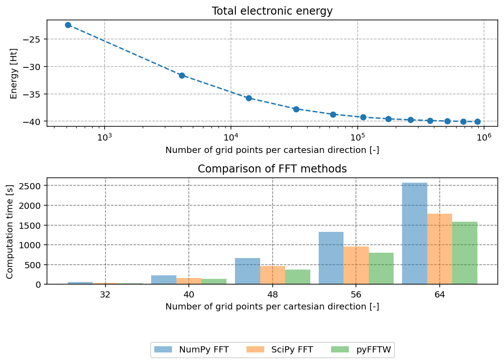

# PyPWDFT
[](https://github.com/ifilot/pypwdft/actions/workflows/build_pypi.yml)
[](https://github.com/ifilot/pypwdft/actions/workflows/build_conda.yml)
[](https://anaconda.org/ifilot/pypwdft)
[](https://pypi.org/project/pypwdft/)
[](https://www.gnu.org/licenses/gpl-3.0)

## Purpose
Plane wave DFT electronic solver for educational purposes.

## Properties

* Plane wave basis set
* **No** pseudopotential implementation
* Slater exchange functional
* Vosko-Wilk-Nusair correlation functional (VWN5)
* Dualism: the same basis set is used to describe both the molecular orbitals
  as well as the electron density.
* Option to specify FFT module (NumPy, SciPy or pyFFTW)

## Dependencies

`PyPWDFT` depends on the following modules:

* [NumPy](https://numpy.org/)
* [Scipy](https://scipy.org/)
* [pyFFTW](https://pyfftw.readthedocs.io/)

## Example calculation

The script below shows an example calculation for the methane molecule placed in
a cubic unit cell with edge sizes of 10 Bohr. First, a `PeriodicSystem` object
is created that contains the dimensions of the cubic unit cell and the number of
sampling points per Cartesian direction. The atoms are placed inside the unit
cell. They are entered in Cartesian coordinates and are expected to lie within
the unit cell. Note that `PyPWDFT` uses [atomic units ](https://en.wikipedia.org/wiki/Atomic_units)
throughout the code. This means that all distances are in Bohr units and
all energies are in Hartrees.

Next, a `PyPWDFT` calculator object is constructed. The `PeriodicSystem` object
is supplied as input. During initialization of the `PyPWDFT` calculator object,
the user can also chose the preferred type of FFT algorithm. `PyPWDFT` can use
NumPy FFT, Scipy FFT or PyPWDFT. Benchmark studies show that the latter is the
most efficient algorithm, which is therefore also the default choice if nothing
is specified by the user.

To start the self-consistent field procedure, the `SCF()` method of the
calculator object is executed. This method takes as input the criterion for
electronic convergence (`tolerance`) and whether verbose output is requested.
Using verbose output, the total electronic energy and computation time per
electronic step in the SCF procedure is printed.

```python
# import the required libraries for the test
from pypwdft import PyPWDFT, PeriodicSystem, MoleculeBuilder
import numpy as np

def main():
    # create cubic periodic system with lattice size of 10 Bohr
    npts = 16   # number of grid points
    sz = 10
    # construct CH4 molecule system via SystemBuilder
    s = SystemBuilder().from_name('CH4', sz=sz, npts=npts)
        
    # construct calculator object
    calculator = PyPWDFT(s)
    
    # perform self-consistent field procedure and store results in res object
    res = calculator.scf(tol=1e-1, verbose=True)

if __name__ == '__main__':
    main()
```

This calculation gives the output as shown below. Note that this calculation
uses a fairly small number of plane waves (only 4096) and a loose tolerance.
This has the benefit that the computation time is rather short, yet the final
electronic energy is quite far off from the expected value for a LDA/DFT
calculation of methane. Nevertheless, qualitatively decent molecular orbital
shapes are found.

```
001 | Etot =  10.70148118 Ht | eps = 1.0701e+01 | dt = 0.0505 s
002 | Etot =  -8.01768059 Ht | eps = 1.8719e+01 | dt = 0.0381 s
003 | Etot = -19.73474499 Ht | eps = 1.1717e+01 | dt = 0.0488 s
004 | Etot = -25.38933285 Ht | eps = 5.6546e+00 | dt = 0.0586 s
005 | Etot = -28.06387148 Ht | eps = 2.6745e+00 | dt = 0.0632 s
006 | Etot = -29.47265035 Ht | eps = 1.4088e+00 | dt = 0.0693 s
007 | Etot = -30.27492437 Ht | eps = 8.0227e-01 | dt = 0.0706 s
008 | Etot = -30.75674641 Ht | eps = 4.8182e-01 | dt = 0.0756 s
009 | Etot = -31.05689472 Ht | eps = 3.0015e-01 | dt = 0.0743 s
010 | Etot = -31.24824460 Ht | eps = 1.9135e-01 | dt = 0.0773 s
011 | Etot = -31.37191520 Ht | eps = 1.2367e-01 | dt = 0.0789 s
012 | Etot = -31.45248517 Ht | eps = 8.0570e-02 | dt = 0.0751 s
```

## Example results

Occupied molecular orbitals of CH4 (10x10x10 A cell, 16 grid points, 1e-1 tolerance)


Valence molecular orbitals of CO (10x10x10 A cell, 32 grid points, 1e-4 tolerance)


## Computational details

In contrast to localized orbital DFT, the basis functions in plane wave DFT are
not 'spawned' by the atoms but by the unit cell. The number of plane waves is
determined by the number of sampling points. `PyPWDFT` uses cubic unit cells and
a fixed number of grid points per Cartesian direction. To get a proper
description (expansion) of the electron density and of the atomic orbitals, the
plane wave basis set needs to be relatively large. In comparison to localized
orbital DFT, many more basis functions are needed and plane wave basis set host
thousands (if not more) of basis functions. For this reason, the Hamiltonian
matrix in the electronic structure problem is not solved in full, but only the
part corresponding to its lowest eigenvalues (the occupied molecular orbitals)
is solved. In `PyPWDFT`, the Implicitly Restarted Arnoldi Method as implemented
in the [eigs function of Scipy](https://docs.scipy.org/doc/scipy/reference/generated/scipy.sparse.linalg.eigs.html)
is used for this purpose.

Conventional plane wave DFT calculations use a so-called frozen core
approximation wherein the core electrons are not explicitly calculated but are
represented by a pseudopotential. As the core electrons do not participate in
chemical bonding, their wave function varies little by the chemical environment
of the nuclei and one could therefore keep them fixed. `PyPWDFT` does not use
such pseudopotentials and explicitly calculates the core electrons.
Unfortunately, the core electrons require a large amount of plane waves for an
accurate description. As such, if one requires an accurate calculation using
`PyPWDFT`, a very large basis set is required which will result in lengthy
calculations.

## Scaling properties

Because `PyPWDFT` is a Python-based program, it will be (significantly) slower
than commercial PW-DFT packages which use compiled languages such as C++ and/or
FORTRAN. To assess the efficiency and scaling properties of `PyPWDFT`, consider
the methane molecule inside a 10x10x10 Bohr unit cell as a probe system.
In the graph below, the total energy and computation time as function of the
number of grid points per Cartesian direction is shown.



## Other interesting codes

* The [SimpleDFT](https://gitlab.com/wangenau/simpledft) code of Wanja Schulze
  is another Python-based plane wave DFT code. In contrast to `PyPWDFT`,
  `SimpleDFT` uses a steepest descent method. Furthermore, `PyPWDFT` is built
  upon the rather elegant alternative 
  [algebraic formulation of Thomas Arias](https://arxiv.org/abs/cond-mat/9909130).
* [PyDFT](https://gitlab.tue.nl/ifilot/pydft) is a localized orbital DFT code
  written in Python.
* [PyQInt](https://pyqint.imc-tue.nl/) is a Hartree-Fock based electronic
  structure code, also written in Python.