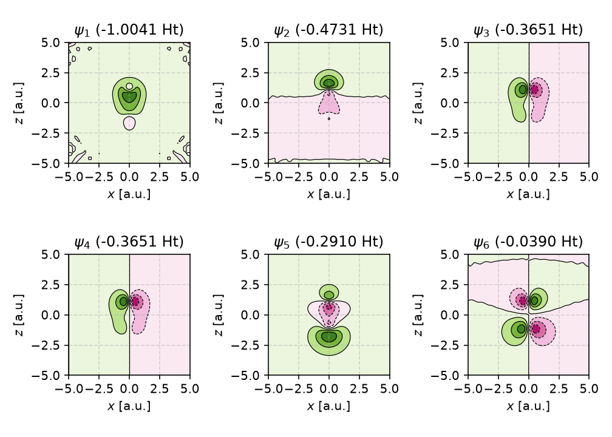

# PyPWDFT

[](https://github.com/ifilot/pypwdft/actions/workflows/build_pypi.yml)
[](https://pypi.org/project/pypwdft/)
[](https://www.gnu.org/licenses/gpl-3.0)

PyPWDFT is an educational pure-Python plane-wave density-functional theory
solver. It supports LDA and PBE exchange-correlation functionals, GTH
pseudopotentials, multiple CPU FFT implementations, and an optional CuPy/CUDA
backend.

> [!IMPORTANT]
> PyPWDFT was developed independently and has no affiliation with the program
> of the same name described by Yang et al. The code in this repository
> predates that publication.

## Installation

```bash
pip install pypwdft
```

## Quick start

```python
from pypwdft import PWDFT, Structure

structure = Structure.from_name("H2", cell=10)
calculation = PWDFT(
    structure,
    cutoff=40,
    xc="pbe",
    pseudopotential="gth",
)
result = calculation.run(
    convergence=1e-6,
    verbosity=1,
)

print(result.energy.total)
result.plot_orbitals(
    plane="xz",
    save="h2-orbitals.png",
)
```

The API separates three concepts:

- `Structure`: atoms, coordinates, units, and cubic simulation cell.
- `PWDFT`: physical and numerical calculation settings.
- `DFTResult`: energies, orbitals, density, basis details, and SCF metadata.

PyPWDFT uses atomic units by default: lengths are in bohr and energies are in
Hartree.

## Structures

Load a bundled molecule or an XYZ file:

```python
methane = Structure.from_name("CH4", cell=12)
water = Structure.from_xyz("water.xyz", cell=12)
```

XYZ coordinates are interpreted as angstrom; `cell` is in bohr. Structures
can also be constructed directly:

```python
hydrogen = Structure(
    symbols=["H", "H"],
    positions=[[0, 0, -0.37], [0, 0, 0.37]],
    cell=6,
    units="angstrom",
)
```

## Calculation configuration

```python
calculation = PWDFT(
    methane,
    cutoff=40,
    density_cutoff=160,
    xc="pbe",
    pseudopotential="gth",
    device="cpu",
)
```

Selecting `pseudopotential="gth"` automatically matches GTH-PADE to LDA and
GTH-PBE to PBE. Advanced valence selections use `GTH`:

```python
from pypwdft import GTH

calculation = PWDFT(
    structure,
    cutoff=40,
    xc="pbe",
    pseudopotential=GTH(charges={"Ga": 13}),
)
```

Use `pseudopotential="all-electron"` for an all-electron Coulomb calculation.

## SCF settings

```python
from pypwdft import SCFSettings

settings = SCFSettings(
    convergence=1e-6,
    density_convergence=1e-6,
    max_iterations=150,
    bands=8,
    verbosity=1,
)
result = calculation.run(settings)
```

Settings can also be supplied directly to `run()`.

## Results

All results are exposed via a `DFTResult` dataclass which has the following
data items.

```python
result.energy.total
result.energy.kinetic
result.energy.hartree
result.energy.xc

result.density
result.orbitals.energies
result.orbitals.real_space
result.orbitals.reciprocal_space

result.basis.plane_waves
result.basis.wavefunction_grid
result.basis.density_grid

result.scf.converged
result.scf.iterations
result.scf.energy_residual
result.scf.elapsed_time
```

## Plotting

```python
result.plot_orbitals(
    plane="xz",
    columns=3,
    save="orbitals.pdf",
    show_imaginary_norm=False,
)
result.plot_density(plane="xz", save="density.pdf")
```

Contour plots use symmetric orbital amplitudes, black isolines, physical axes,
and configurable `xy`, `xz`, or `yz` planes. By default, titles report any
imaginary norm that cannot be removed by a global phase rotation; set
`show_imaginary_norm=False` to suppress this diagnostic.

For batches containing orbitals with different nodal planes, use
`plane="auto"` to select the most informative central plane per orbital.
`ngrid` controls the number of ticks and `tick_rotation` rotates their labels.

## GPU calculations

After installing a CuPy wheel compatible with the local CUDA runtime:

```python
calculation = PWDFT(
    structure,
    cutoff=40,
    xc="pbe",
    pseudopotential="gth",
    device="cuda",
)
result = calculation.run()
```

Returned energies and fields are ordinary Python scalars and NumPy arrays.

## Features

- Spherical plane-wave basis with automatically derived FFT grids
- GTH frozen-core pseudopotentials with local and non-local terms
- LDA/SVWN5 and PBE exchange-correlation functionals
- NumPy, SciPy, and pyFFTW CPU backends
- Optional CuPy/CUDA execution
- Typed energy, orbital, basis, and SCF results
- Molecular-orbital and density contour plotting

## Example results

Valence molecular orbitals of CO:



## License

PyPWDFT is distributed under the GNU General Public License version 3 or later.
