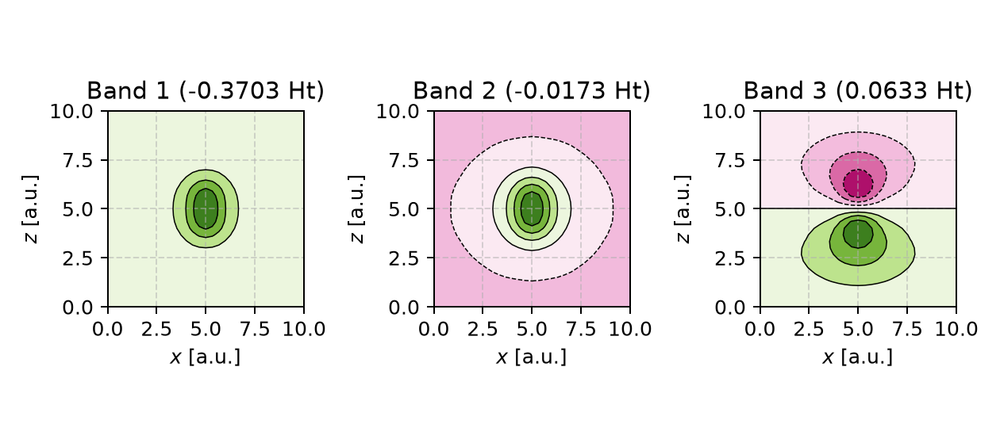

.. _getting_started:
.. index:: Getting started

Getting started
===============

A PyPWDFT calculation has three parts: a :class:`pypwdft.Structure` describes
the atoms and simulation cell, :class:`pypwdft.PWDFT` contains the physical
and numerical settings, and :class:`pypwdft.DFTResult` stores the calculated
energies, orbitals, density, and convergence information.

In this example, we calculate three Kohn--Sham states (also called bands) for
an H\ :sub:`2` molecule and inspect their energies and shapes.

Complete input
--------------

Save the following program as ``h2.py``:

.. code:: python

   from pypwdft import PWDFT, Structure

   # Load the bundled H2 geometry and place it at the centre of a cubic,
   # 10-bohr simulation cell.
   structure = Structure.from_name("H2", cell=10)

   # Configure a PBE calculation using GTH pseudopotentials. A cutoff of
   # 10 Hartree keeps this introductory calculation quick.
   calculation = PWDFT(
       structure,
       cutoff=10,
       xc="pbe",
       pseudopotential="gth",
   )

   # Calculate the occupied state and the two lowest unoccupied states.
   result = calculation.run(
       convergence=1e-6,
       density_convergence=1e-6,
       bands=3,
       verbosity=1,
   )

   print("\nResults")
   print("-------")
   print(f"Converged: {result.scf.converged}")
   print(f"SCF iterations: {result.scf.iterations}")
   print(f"Total energy: {result.energy.total:.8f} Ha")
   for number, energy in enumerate(result.orbitals.energies, start=1):
       print(f"Band {number} energy: {energy:.8f} Ha")

   # occupied=False includes the calculated unoccupied states in the plot.
   result.plot_orbitals(
       occupied=False,
       plane="xz",
       columns=3,
       labels=["Band 1", "Band 2", "Band 3"],
       show_imaginary_norm=False,
       save="h2-bands.png",
   )

Run it from the activated virtual environment:

.. code:: bash

   python h2.py

Example output
--------------

With ``verbosity=1``, PyPWDFT first prints the calculation setup and the SCF
iteration history. Timing values vary by computer; the relevant parts of the
output should resemble:

.. code:: text

   ========================================================================
   PyPWDFT self-consistent field calculation
   ------------------------------------------------------------------------
   XC functional          : PBE
   Ionic model            : GTH-PBE pseudopotential
   FFT backend            : pyFFTW (CPU)
   Wavefunction cutoff    : 10 Ha (272.11 eV)
   Density cutoff         : 40 Ha
   Cubic unit cell        : 10.000000 x 10.000000 x 10.000000 bohr
   Plane waves            : 1503
   Electrons              : 2
   Occupied orbitals      : 1
   Computed orbitals      : 3
   ...
   SCF iterations
   Iter | Total energy (Ha) |       dE |       dn | Time (s)
   ------------------------------------------------------------------------
   001 | Etot =  -1.07334587 Ht | dE = 1.0733e+00 | dn = 1.5595e-02 | ...
   ...
   012 | Etot =  -1.13086242 Ht | dE = 2.3287e-09 | dn = 6.6000e-08 | ...

   Results
   -------
   Converged: True
   SCF iterations: 12
   Total energy: -1.13086242 Ha
   Band 1 energy: -0.37032076 Ha
   Band 2 energy: -0.01734384 Ha
   Band 3 energy: 0.06328328 Ha

Small differences in the final digits can result from the numerical libraries
and hardware in use. ``Converged: True`` confirms that both the energy and
density residuals reached the requested thresholds.

Visualizing the result
----------------------

The final call to :meth:`pypwdft.DFTResult.plot_orbitals` produces the image
below. Green and pink contours represent opposite signs of the orbital
amplitude; they do not represent positive and negative charge. Black lines are
isolines of equal amplitude. The axes use the fixed unit-cell coordinates from
zero to 10 bohr; the molecule is centred around ``(5, 5, 5)``.

The result may initially look unexpected. Band 1 resembles the familiar
bonding orbital, but Band 2 does not have a node between the nuclei. The
antibonding-looking state appears only as Band 3. The following sections
explain why.

Occupied and unoccupied bands
-----------------------------

H\ :sub:`2` has two electrons. PyPWDFT currently uses a closed-shell model,
so both electrons occupy Band 1, the same lowest-energy spatial orbital, with
opposite spins. Bands 2 and 3 are empty in the ground-state calculation.

Setting ``bands=3`` tells the eigensolver to return the three lowest
Kohn--Sham states. It does not place electrons in all three states. The
ground-state density is still constructed from Band 1 alone:

.. math::

   \rho(\mathbf r) = 2|\psi_1(\mathbf r)|^2.

Requesting additional bands therefore exposes more of the unoccupied spectrum
but does not improve or otherwise change the converged ground-state density.
It only adds work to the eigensolver.

Here, "band" means a Kohn--Sham eigenstate at the :math:`\Gamma`-point.
PyPWDFT does not sample a sequence of crystal momenta, so this example is not a
conventional electronic band-structure calculation. For a molecule, these
states can also be called Kohn--Sham orbitals.

The expectation from a chemical MO diagram
------------------------------------------

The usual introductory H\ :sub:`2` diagram uses the smallest possible
linear-combination-of-atomic-orbitals (LCAO) basis: one hydrogen 1s orbital on
each atom. Only two combinations can be made:

.. math::

   \sigma_g \mathrel{\propto} 1s_A + 1s_B,
   \qquad
   \sigma_u^* \mathrel{\propto} 1s_A - 1s_B.

The first is bonding and the second is antibonding. In this model the
antibonding orbital must be the second state because the two 1s basis
functions cannot produce any other state. This is a useful chemical model,
but it is not a complete description of all solutions of the Kohn--Sham
Hamiltonian.

What is a diffuse vacuum state?
-------------------------------

PyPWDFT uses plane waves instead of atom-centred 1s functions. A plane wave
extends throughout the entire unit cell, and combinations of plane waves can
represent both orbitals near the molecule and states spread across the large
empty region surrounding it. In this example the molecule occupies only a
small part of the 10-bohr cell; the rest of the cell is the vacuum region used
to separate the molecule from its periodic copies.

"Diffuse" means that the orbital amplitude is distributed over a large
fraction of that empty region instead of being concentrated on an atom or in
a bond. "Vacuum state" does not mean that another substance or an extra
electron has been added. It means that the mathematical state primarily uses
the nominally empty space in the simulation cell. Because the calculation is
periodic, the same diffuse state repeats in every copy of the cell.

For an isolated molecule, sufficiently high-energy electrons form a continuum
of unbound scattering states. A finite periodic cell cannot represent a true
continuum. Its boundary conditions turn that continuum into a discrete set of
normalizable, cell-wide states. These are sometimes described as
continuum-like, box, supercell, or vacuum states. Band 2 in the figure is such
a diffuse supercell state: compared with Band 1, its contours extend much
farther into the empty part of the cell and it has no node between the hydrogen
nuclei.

The labels "molecular", "Rydberg-like", and "vacuum-like" are not always
sharply separated for an unoccupied state in a finite cell. Band 2 retains a
central lobe around H\ :sub:`2`, but its outer amplitude occupies the vacuum
region and its energy and shape can respond to the cell boundary. It is
therefore most useful here to call it a diffuse, :math:`\sigma_g`-like
supercell state rather than assign it to a pure hydrogen 1s bonding or
antibonding combination.

A diffuse state can have a relatively low Kohn--Sham eigenvalue because it is
smooth and slowly varying. Such a shape has little curvature and therefore a
small kinetic-energy contribution. The antibonding state must change sign
between the atoms, creating a node and additional curvature. At the cell size
and cutoff used here, the eigensolver consequently places the diffuse state
below the antibonding-like state:

* **Band 1** is the occupied :math:`\sigma_g`-like bonding state.
* **Band 2** is an unoccupied diffuse, :math:`\sigma_g`-like supercell state.
* **Band 3** is the unoccupied :math:`\sigma_u^*`-like antibonding state.

Identifying the antibonding state
---------------------------------

The H--H axis lies along :math:`z`, with the nuclei on either side of
``z=5``. Band 3 changes sign across that midpoint: one lobe is green and the
other is pink. Its wavefunction is zero in the plane between the nuclei. This
internuclear node and phase change identify its :math:`\sigma_u^*`
antibonding character.

The eigensolver sorts states by energy, not by resemblance to a chemical MO
diagram. Unoccupied-state energies and ordering can change with the unit-cell
size, cutoff, and exchange--correlation approximation. They should therefore
be identified from their symmetry, nodal structure, and spatial localization,
not from their band number alone. In particular, Band 3 is called
"antibonding-like" because of its shape and symmetry; its Kohn--Sham energy is
not an exact molecular excitation energy.

Interpreting the reported energies
----------------------------------

The total energy is the energy of the complete interacting system; it is not
the sum of the three Kohn--Sham band energies. Differences between occupied
and unoccupied Kohn--Sham energies should also not generally be interpreted as
exact excitation energies.

The modest 10-Hartree cutoff is appropriate for a fast demonstration, not a
converged scientific result. Production calculations should check convergence
with respect to both the cutoff and cell size. PyPWDFT uses atomic units by
default: cell dimensions and direct coordinates are in bohr, while energies
are in Hartree. XYZ-file coordinates are read in angstrom. See :doc:`usage`
for structure input, convergence settings, result fields, and plotting options.
