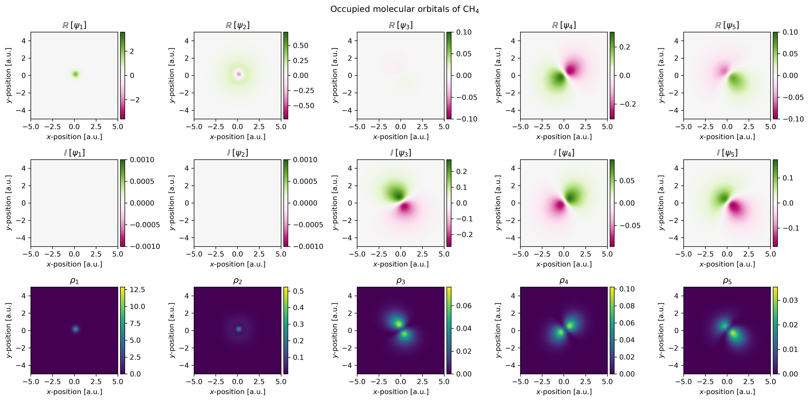
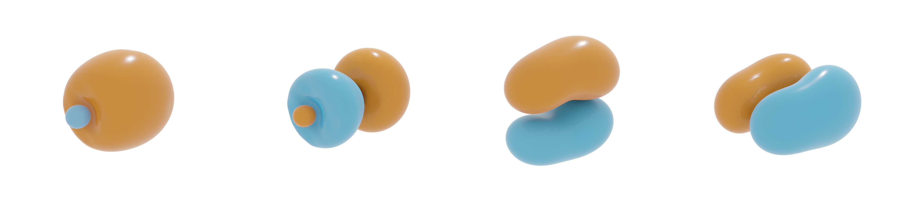
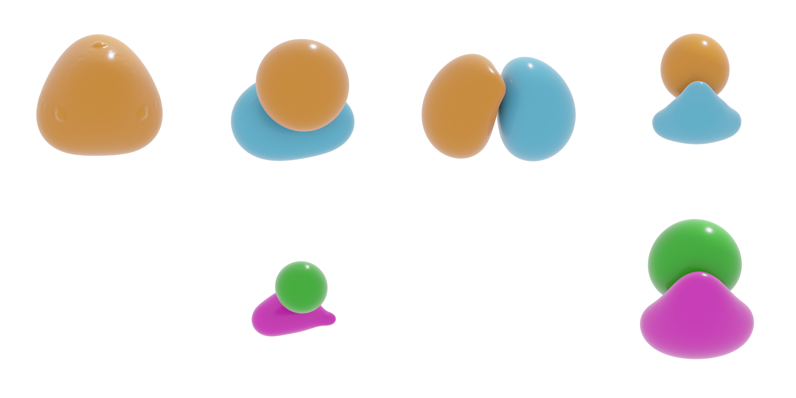

.. _usage:
.. index:: Usage

Usage
=====

Creating atomic systems
-----------------------

To perform an electronic structure calculation, one first has to define an
atomic system. This can be done in two ways, either manually or by means of the
:class:`pypwdft.SystemBuilder` class.

Automatic
#########

The most straightforward way is to use the :class:`pypwdft.SystemBuilder` class.
To build a system, one can run

.. code:: python

    from pypwdft import SystemBuilder, PeriodicSystem

    # create cubic periodic system with lattice size of 10 Bohr units
    npts = 16   # number of grid points
    sz = 10
    
    # construct CH4 molecule system via SystemBuilder
    s = SystemBuilder().from_name('CH4', sz=sz, npts=npts)

To view the unit cell matrix and the atomic coordinates, one can simply invoke

.. code:: python

    print(s)

which in the above scenario yields the following output

.. code::

    [[10.  0.  0.]
     [ 0. 10.  0.]
     [ 0.  0. 10.]]
    6  (5.0000  5.0000  5.0000)
    1  (6.1958  6.1958  6.1958)
    1  (3.8042  3.8042  6.1958)
    1  (3.8042  6.1958  3.8042)
    1  (6.1958  3.8042  3.8042)

The following molecules are available via the :class:`pypwdft.SystemBuilder`
class:

* benzene
* bf3
* ch4
* co
* ethylene
* h2
* h2o
* he
* lih
* nh3

.. note::

    Unless otherwise specified, atomic units are used throughout the program.
    This means that all distances are provided in Bohr units.

Manual
######

Alternatively, one can also build a system by hand. First, define the unit cell
and the number of sampling points per Cartesian direction.

.. code:: python

    from pypwdft import PeriodicSystem

    npts = 32   # number of grid points
    sz = 10     # edge size of cubic unit cell
    s = PeriodicSystem(sz, npts)

Next, one can add atoms to the PeriodicSystem by means of the 
:class:`pypwdft.PeriodicSystem.add_atom` method

.. code:: python

    # atomic positions
    atompos = np.array([[5.00000000, 5.00000000, 5.00000000],
                        [6.19575624, 6.19575624, 6.19575624],
                        [3.80424376, 3.80424376, 6.19575624],
                        [3.80424376, 6.19575624, 3.80424376],
                        [6.19575624, 3.80424376, 3.80424376]])
    
    # atomic charges
    charges = [6, 1, 1, 1, 1] # C + 4 x H

    # add atoms to the system
    for p,c in zip(atompos, charges):
        s.add_atom(p[0], p[1], p[2], c)

Performing electronic structure calculation
-------------------------------------------

Electronic structure calculations are handled by the :class:`pypwdft.PyPWDFT`
class. For each separate electronic structure calculation, one creates a fresh
instance of this class. Upon instancing, a :class:`pypwdft.PeriodicSystem`
instance is provided. Furthermore, the user can select which FFT algorithm is
being used. Three options are available:

* `NumPy FFT <https://numpy.org/doc/stable/reference/routines.fft.html>`_ : :code:`numpy`
* `Scipy FFT <https://docs.scipy.org/doc/scipy/tutorial/fft.html>`_ : :code:`scipy`
* `pyFFTW FFT <https://pypi.org/project/pyFFTW/>`_ : :code:`pyfftw`

By default, :code:`pyfftw` is used as this algorithm provides the best
performance.

After building the :class:`pypwdft.PyPWDFT` instance, the electronic structure
calculation can be invoked by running :class:`pypwdft.PyPWDFT.scf`. This
function allows for several parameters tuning the execution. The default
parameters are however typically suitable. By default, no output is written to
the console, but this can be changed by setting :code:`verbose=True`. Below,
an example is provided how to set-up a electronic structure calculation.

.. code:: python

    from pypwdft import PyPWDFT, PeriodicSystem, SystemBuilder

    # create cubic periodic system with lattice size of 10 Bohr units
    npts = 32   # number of grid points
    sz = 10
    
    # construct CH4 molecule system via SystemBuilder
    s = SystemBuilder().from_name('CH4', sz=sz, npts=npts)
        
    # construct calculator object
    calculator = PyPWDFT(s)
    
    # perform self-consistent field procedure and store results in res object
    res = calculator.scf(tol=1e-5, verbose=True)

Upon execution of this code, the following output is written to the console

.. code::

    001 | Etot =  25.72188838 Ht | eps = 2.5722e+01 | dt = 0.5023 s
    002 | Etot =  -3.73540233 Ht | eps = 2.9457e+01 | dt = 0.5098 s
    003 | Etot = -21.73526459 Ht | eps = 1.8000e+01 | dt = 0.5807 s
    ...
    031 | Etot = -37.74458043 Ht | eps = 2.4958e-05 | dt = 0.9166 s
    032 | Etot = -37.74459617 Ht | eps = 1.5732e-05 | dt = 1.0046 s
    033 | Etot = -37.74460604 Ht | eps = 9.8741e-06 | dt = 1.0156 s

Furthermore, the result of the calculation are stored in a so-called results
dictionary. This dictionary contains the following entries:

* :code:`Energy` : List of total electronic energy per iteration
* :code:`Etot` : Total electronic energy
* :code:`Ekin` : Kinetic energy
* :code:`Enuc` : Nuclear attraction energy
* :code:`Erep` : Electron-electron repulsion energy
* :code:`Exc` : Exchange-correlation energy
* :code:`edens` : Electron density scalar field
* :code:`k2` : Plane wave vector magnitudes
* :code:`dV` : Real-space integration constant
* :code:`Eewald` : Nuclear-nuclear repulsion (Ewald sum)
* :code:`orbc_fft` : Reciprocal-space representation of the molecular orbitals
* :code:`orbe` : Molecular orbital energies
* :code:`orbc_rs` : Real-space representation of the molecular orbitals
* :code:`ttime` : Total computation time

.. note::

    All energies are provided in Hartrees.

Visualizing molecular orbitals
------------------------------

Molecular orbitals can be visualized using `matplotlib
<https://matplotlib.org/>`_. The results of the :class:`pypwdft.PyPWDFT.scf`
routine is a dictionary of which one of its elements is :code:`orbc_rs`. This
element corresponds to a four-dimensional array where the first index loops over
the molecular orbitals with increasing orbital energy. 

Two-dimensional projections
###########################

By setting the two indices, one can essentially extract a specific z-layer from
the scalar field of any of the molecular orbitals and in turn visualize these
using the :code:`imshow` function of matplotlib. This is demonstrated in the
script below.

.. note::

    The wave functions generated by a plane wave density functional theory
    calculation are complex values, i.e.

    .. math::

        \psi(\vec{r}) \in \mathbb{C}^{3}

    and as such, it is recommended to visualize both the real and complex parts of
    the wave function as well as its electron density as given by

    .. math::

        \rho = |\psi(\vec{r})|^{2} = \psi(\vec{r}) \cdot \psi^{*}(\vec{r}).

.. code::

    # import the required libraries for the test
    from pypwdft import PyPWDFT, PeriodicSystem, SystemBuilder
    import numpy as np
    import matplotlib.pyplot as plt
    from mpl_toolkits.axes_grid1 import make_axes_locatable

    def main():
        # create cubic periodic system with lattice size of 10 Bohr units
        npts = 32   # number of grid points
        sz = 10
        
        # construct CH4 molecule system via SystemBuilder
        s = SystemBuilder().from_name('CH4', sz=sz, npts=npts)
            
        # construct calculator object
        calculator = PyPWDFT(s)
        
        # perform self-consistent field procedure and store results in res object
        res = calculator.scf(tol=1e-1, verbose=True)
        
        # visualize the occupied molecular orbitals
        fig, im = plt.subplots(3,5, dpi=300, figsize=(16,8))
        extent=[-sz/2,sz/2,-sz/2,sz/2]
        orbe = res['orbe']
        fig.suptitle('Occupied molecular orbitals of CH$_{4}$')
        m = np.empty((3,5), dtype=object) # create placeholder for maps
        
        for i in range(0,5):
            # visualize the real part of the wave function
            field = np.real(res['orbc_rs'][i][npts//2, :, :])
            maxval = max(np.max(np.abs(field)), 0.1)
            m[0][i] = im[0,i].imshow(field, origin='lower',
                    interpolation='bicubic', extent=extent, cmap='PiYG',
                    vmin=-maxval, vmax=maxval)
            im[0,i].set_title(r'$\mathbb{R}\;[\psi_{%i}]$' % (i+1))
            
            # visualize the imaginary part of the wave function
            field = np.imag(res['orbc_rs'][i][npts//2, :, :])
            maxval = max(np.max(np.abs(field)), 0.001)
            m[1][i] = im[1,i].imshow(field, origin='lower',
                    interpolation='bicubic', extent=extent, cmap='PiYG',
                    vmin=-maxval, vmax=maxval)
            im[1,i].set_title(r'$\mathbb{I}\;[\psi_{%i}]$' % (i+1))
            
            # visualize the electron density
            m[2][i] = im[2,i].imshow(np.real(res['orbc_rs'][i][npts//2, :, :].conj() * 
                                res['orbc_rs'][i][npts//2, :, :]), 
                        origin='lower', interpolation='bicubic', extent=extent)
            im[2,i].set_title(r'$\rho_{%i}$' % (i+1))
            
        for j in range(0,3):
            for i in range(0,5):
                im[j,i].set_xlabel('$x$-position [a.u.]')
                im[j,i].set_ylabel('$y$-position [a.u.]')
                
                divider = make_axes_locatable(im[j,i])
                cax = divider.append_axes('right', size='5%', pad=0.05)
                fig.colorbar(m[j][i], cax=cax, orientation='vertical')
            
        plt.tight_layout()
        
    if __name__ == '__main__':
        main()

The result of running this script is shown below.

Isosurfaces
###########

Alternative to two-dimensional projections, one can also create isosurfaces. For
this, we will use the external module `PyTessel
<https://pytessel.imc-tue.nl/>`_. For isosurfaces, a relatively large number of
sampling points for the scalar fields are required. However, this comes at the
expense of computational time. To tackle this, we can use upsampling procedures.
Here, we show two such upsampling methods, corresponding to quintic
interpolation and frequency-domain upsampling.

Quintic interpolation
^^^^^^^^^^^^^^^^^^^^^

We will perform the electronic structure calculation initially using only 32
sampling points per Cartesian direction and follow up using quintic
interpolation to "upsample" the scalar fields. An example of this process is
shown in the image below.

.. code::

    import numpy as np
    from pytessel import PyTessel
    from scipy.interpolate import RegularGridInterpolator
    from pypwdft import PyPWDFT, SystemBuilder, PeriodicSystem

    def main():
        # create cubic periodic system with lattice size of 10 Bohr units
        npts = 32       # number of grid points
        sz = 10
        
        # construct CO molecule system via SystemBuilder
        s = SystemBuilder().from_name('CO', sz=sz, npts=npts)
            
        # construct calculator object
        calculator = PyPWDFT(s)
        
        # perform self-consistent field procedure and store results in res object
        res = calculator.scf(tol=1e-5, nsol=9, verbose=True)
        
        # generate PyTessel object
        pytessel = PyTessel()
        
        for i in range(2,9):
            print('Building isosurfaces: %02i' % (i+1))
            scalarfield = interpolate_grid(res['orbc_rs'][i], sz, npts, 4)
            unitcell = np.identity(3) * sz
            
            # build positive real isosurface
            vertices, normals, indices = pytessel.marching_cubes(scalarfield.real.flatten(), scalarfield.shape, unitcell.flatten(), 0.1)
            pytessel.write_ply('MO_PR_%02i.ply' % (i+1), vertices, normals, indices)
            
            # build negative real isosurface
            vertices, normals, indices = pytessel.marching_cubes(scalarfield.real.flatten(), scalarfield.shape, unitcell.flatten(), -0.1)
            pytessel.write_ply('MO_NR_%02i.ply' % (i+1), vertices, normals, indices)
            
            # build positive imaginary isosurface
            vertices, normals, indices = pytessel.marching_cubes(scalarfield.imag.flatten(), scalarfield.shape, unitcell.flatten(), 0.1)
            pytessel.write_ply('MO_PI_%02i.ply' % (i+1), vertices, normals, indices)
            
            # build negative imaginary isosurface
            vertices, normals, indices = pytessel.marching_cubes(scalarfield.imag.flatten(), scalarfield.shape, unitcell.flatten(), -0.1)
            pytessel.write_ply('MO_NI_%02i.ply' % (i+1), vertices, normals, indices)

    def interpolate_grid(scalarfield, sz, npts, amp=2):
        x = np.linspace(0, sz, npts)
        interp = RegularGridInterpolator((x,x,x), scalarfield, method='quintic')
        s = PeriodicSystem(sz, npts * amp)
        points = s.get_r()
        
        return interp(points)

    if __name__ == '__main__':
        main()

In the image below, the isosurfaces corresponding to the real part of the scalar
field for the 3σ, 4σ and 1π orbitals are visualized.

Frequency domain upsampling
^^^^^^^^^^^^^^^^^^^^^^^^^^^

In the code below, an example for frequency scale upsampling is shown.

.. code::

    import numpy as np
    from pytessel import PyTessel
    from pypwdft import PyPWDFT, SystemBuilder

    def main():
        # create cubic periodic system with lattice size of 10 Bohr units
        npts = 32       # number of grid points
        sz = 10
        
        # construct CO molecule system via SystemBuilder
        s = SystemBuilder().from_name('CH4', sz=sz, npts=npts)
            
        # construct calculator object
        calculator = PyPWDFT(s)
        
        # perform self-consistent field procedure and store results in res object
        res = calculator.scf(tol=1e-5, verbose=True)
        
        # print molecular orbital energies
        print(res['orbe'])
        
        # generate PyTessel object
        pytessel = PyTessel()
        
        for i in range(5):
            print('Building isosurfaces: %02i' % (i+1))
            scalarfield = upsample_grid(res['orbc_fft'][i], sz**3, 4)
            unitcell = np.identity(3) * sz
            
            # build positive real isosurface
            vertices, normals, indices = pytessel.marching_cubes(scalarfield.real.flatten(), scalarfield.shape, unitcell.flatten(), 0.03)
            pytessel.write_ply('MO_PR_%02i.ply' % (i+1), vertices, normals, indices)
            
            # build negative real isosurface
            vertices, normals, indices = pytessel.marching_cubes(scalarfield.real.flatten(), scalarfield.shape, unitcell.flatten(), -0.03)
            pytessel.write_ply('MO_NR_%02i.ply' % (i+1), vertices, normals, indices)
            
            # build positive imaginary isosurface
            vertices, normals, indices = pytessel.marching_cubes(scalarfield.imag.flatten(), scalarfield.shape, unitcell.flatten(), 0.03)
            pytessel.write_ply('MO_PI_%02i.ply' % (i+1), vertices, normals, indices)
            
            # build negative imaginary isosurface
            vertices, normals, indices = pytessel.marching_cubes(scalarfield.imag.flatten(), scalarfield.shape, unitcell.flatten(), -0.03)
            pytessel.write_ply('MO_NI_%02i.ply' % (i+1), vertices, normals, indices)

    def upsample_grid(scalarfield_fft, Omega, upsample=4):
        Nx, Ny, Nz = scalarfield_fft.shape
        Nx_up = Nx * upsample
        Ny_up = Nx * upsample
        Nz_up = Nx * upsample

        # shift the frequencies
        fft = np.fft.fftshift(scalarfield_fft)

        # perform padding
        fft_upsampled = np.pad(fft, [((Nz_up-Nz)//2,),
                                    ((Ny_up-Ny)//2,),
                                    ((Nx_up-Nx)//2,)], 'constant')

        # shift back
        fft_hires = np.fft.ifftshift(fft_upsampled)

        return np.fft.ifftn(fft_hires) * np.prod([Nx_up, Ny_up, Nz_up]) / np.sqrt(Omega)

    if __name__ == '__main__':
        main()

Using the above scripts, the molecular orbitals as shown in the image below are
found. Here, an isovalue of 0.03 was used. Since the molecular orbitals are
complex-valued, both the real-part (orange-blue) as well as the the imaginary
part (purple-green) is visualized provided that the imaginary part has a
significant contribution. Though it might not look to be the case based on the
shape of the orbitals, if one runs the above script, it can be verified that the
latter three orbitals have equal orbital energies.

